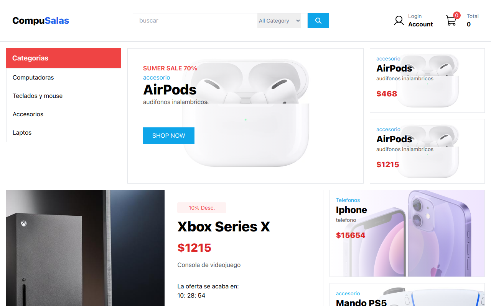

# CompuSalas e-commerce

## Ejemplo en vivo

- [Ver sitio web](https://e-commerce-ecru-alpha.vercel.app/)
- [Ver documentacion de la api](https://doc-ecommerce.netlify.app/docs/rutas/rutas%20de%20usuario/)

## Descripción 📑

Compusalas es un proyecto de ecommerce que se dedica a la venta de productos electrónicos, tecnológicos y de computación en línea. La plataforma permite a los clientes buscar y comprar productos de alta calidad de forma rápida y sencilla desde la comodidad de sus hogares.

La página principal de Compusalas cuenta con una interfaz fácil de usar que muestra las categorías principales de productos disponibles, como computadoras de escritorio, laptops, tablets, accesorios, entre otros. Los usuarios pueden explorar los productos de manera intuitiva y acceder a información detallada de cada artículo, como especificaciones técnicas, precios y disponibilidad en tiempo real.

## Tecnologías 🛠

<!-- Iconos sacados de: https://github.com/hendrasob/badges/blob/master/README.md y https://github.com/alexandresanlim/Badges4-README.md-Profile -->

## Authors

- [@GersonGarayar20](https://www.github.com/octokatherine)
- [@devSalas](https://www.github.com/octokatherine)

## Instalación

- Descárgate el repositorio
- Necesitarás tener instalado npm y node
- Sitúate en la raiz del proyecto e instala las dependencias: `npm install --y`
- Ejecuta este comando para arrancar la aplicación: `npm start`
